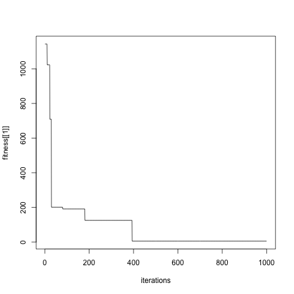

% EA072 - Exercício Computacional 2
% Erick Luis Moraes de Sousa (RA 095696); Guilherme P. Gonçalves (RA 091429)
% Novembro de 2013

# Introdução

Este relatório contém os resultados de cinco exercícios práticos diferentes envolvendo mineração de textos, aproximação de funções contínuas e algoritmos evolutivos aplicados a problemas de otimização.

# Trabalho desenvolvido

O Exercício 1 pedia o desenvolvimento e aplicação de um método de análise de textos em inglês, de forma a extrair alguma informação interessante de um corpo de textos cuja análise seria de outra forma impraticável.

Nossa abordagem aplicou uma técnica conhecida de mineração de textos, o [modelo de espaço vetorial][tf-idf], a um conjunto de emails de spam disponível publicamente, de forma a identificar aqueles que possuem características em comum. Tal análise tem aplicação prática devido à forma como o texto de emails de spam é frequentemente modificado de formas sutis, visando a enganar filtros existentes -- uma vez identificadas as relações de proximidade entre conjuntos de emails indesejados, é possível desenvolver técnicas mais refinadas para tratar aquele conjunto.

[tf-idf]: http://doi.acm.org/10.1145/361219.361220

DESCREVER EXERCÍCIO 2 AQUI

O Exercício 3 abordava o [Problema da Partição][wiki-partition], conhecido por ser NP-Completo, sob o ponto de vista da computação evolutiva. Desenvolvemos um algoritmo com e sem busca local, que foi aplicado a um conjunto de números fornecido pelo professor, de forma a buscar uma bipartição do conjunto que minimizasse a diferença entre as somas dos elementos das duas partes.

[wiki-partition]: https://en.wikipedia.org/wiki/Partition_problem

DESCREVER OS DEMAIS EXERCÍCIOS E SUAS RESOLUÇÕES

# Resultados

# Exercício 1

O algoritmo desenvolvido no Exercício 1 foi implementado na linguagem R e executa sobre o corpo de emails de entrada os seguintes passos:

- Cada email é lido e dividido em palavras com o auxílio da biblioteca [RWeka][rweka]
- Algumas palavras muito comuns (stopwords) são filtradas;
- Alguns caracteres comuns em emails, e outros que não costumam fazer parte de palavras, como > e ", são filtrados das palavras;
- As palavras passam por um processo de _stemming_, novamente usando a biblioteca RWeka, para reduzir palavras semelhantes a uma raiz comum;
- Computa-se um dicionário global contendo todas as palavras de todos os emails;
- Para palavra no dicionário, calcula-se seu índice idf (_inverse document frequency_) em relação ao corpo de emails;
- Para cada palavra e email, calcula-se o índice tf (_term frequency_, número de aparições  da palavra no email);
- Cada email é então descrito por um _feature vector_ dado pelo produto interno entre a linha correspondente a ele na matriz tf e o vetor idf;
- Os _feature vectors_ são agrupados usando o algorithm k-means com distância Euclidiana.

Na última etapa, testamos vários valores de k para o algoritmo k-means, de 1 a 100, e escolhemos o valor 15 segundo o Método do Cotovelo [elbow], conforme ilustrado na Figura 1. O erro é definido como a soma dos quadrados das distâncias de cada vetor ao centro de seu cluster.

Esse algoritmo foi aplicado à parte do conjunto de treinamento classificada como spam do dataset [CSDMC2010][spam], em um total de 1378 emails. 

A Tabela 1 contém o email centróide e o a característica principal identificada para cada cluster, baseado no centróide e nos 3 emails mais próximos a ele, e a Tabela 2 contém esses 3 emails para cada cluster.

 Cluster         Centróide               Característica
---------     ---------------       ---------------------------------------------------------------------------------------------
    1         TRAIN_03956.eml        HTML, pouco texto e links para sites russos de ofertas
    2         TRAIN_02612.eml        Venda de remédios contra disfunção erétil
    3         TRAIN_04237.eml        Textos aleatórios com links falsos para domínios russos
    4         TRAIN_01831.eml        Similar ao cluster 1, com ofertas de medicamentos Pfizer
    5         TRAIN_02392.eml        Venda de relógios Rolex
    6         TRAIN_03025.eml        Notificações de mensagens com links enviadas por Facebook
    7         TRAIN_02581.eml        Emails em HTML vendendo o antivirus Norton      
    8         TRAIN_01324.eml        Emails com assuntos diversos, e corpo codificado em base64
    9         TRAIN_01459.eml        HTML, links e comentários tirados de livros em domínio público
    10        TRAIN_03729.eml        Tentativas de golpes similares ao [scam nigeriano][nigerian]
    11        TRAIN_02948.eml        Nenhuma característica em comum
    12        TRAIN_01064.eml        HTML, venda de acessórios de informática
    13        TRAIN_02491.eml        Ofertas de seguros
    14        TRAIN_01148.eml        Newsletters com forte uso de HTML
    15        TRAIN_00844.eml        Oferta de serviços de spam

Table: Centróides para cada um dos clusters

 Cluster      Emails mais próximos
---------   ------------------------
1           TRAIN_01247.eml TRAIN_02808.eml TRAIN_00105.eml 
2           TRAIN_00694.eml TRAIN_04102.eml TRAIN_02845.eml 
3           TRAIN_03030.eml TRAIN_03837.eml TRAIN_01907.eml 
4           TRAIN_02328.eml TRAIN_02288.eml TRAIN_00371.eml 
5           TRAIN_02033.eml TRAIN_02717.eml TRAIN_01238.eml 
6           TRAIN_01677.eml TRAIN_03142.eml TRAIN_00120.eml 
7           TRAIN_02769.eml TRAIN_02186.eml TRAIN_01776.eml 
8           TRAIN_02915.eml TRAIN_02643.eml TRAIN_03740.eml 
9           TRAIN_03959.eml TRAIN_00791.eml TRAIN_02220.eml 
10           TRAIN_01547.eml TRAIN_01728.eml TRAIN_02195.eml 
11           TRAIN_01182.eml TRAIN_03097.eml TRAIN_00000.eml 
12           TRAIN_04193.eml TRAIN_01150.eml TRAIN_02721.eml 
13           TRAIN_04268.eml TRAIN_01631.eml TRAIN_02590.eml 
14           TRAIN_01058.eml TRAIN_02585.eml TRAIN_01854.eml 
15           TRAIN_00400.eml TRAIN_02835.eml TRAIN_03298.eml

Table: Emails mais próximos do centróide em cada cluster

Foi possível assim obter informações interessantes e um agrupamento razoável a partir dos emails usados como entrada.

# Exercício 3

O algoritmo evolutivo desenvolvido para o Problema da Partição no Exercício 3 pode ser expresso de forma concisa em pseudocódigo. Em alto nível, o espaço do problema é explorado através da geração sucessiva de gerações a partir de um número inicial de indivíduos (1000, em nossos testes), até um número máximo de iterações (também 1000 em nossos experimentos).

~~~
generation = create_initial_generation()
best_individual = get_best_individual(generation)

repeat for max_it iterations:
	next_generation = create_next_generation(generation)
	next_best = get_best_individual(next_generation)

	if next_best is better than best_individual:
		best_individual = next_best
	generation = next_generation
~~~~

Cada indivíduo representa uma possível solução, e é codificado por um vetor binário que dá, para cada número, o conjunto a que ele pertence na bipartição. Logo, para um indivíduo representado por 1001, a bipartição separa o primeiro e o último números dos dois outros. O _fitness_ do indivíduo é dado pela diferença entre as somas dos números em cada conjunto da bipartição; dessa forma, um _fitness_ menor é melhor.

A subrotina `create_initial_generation` simplesmente gera um conjunto de indivíduos aleatórios, e a subrotina `get_best_individual` atravessa os indivíduos de uma geração comparando seu _fitness_ e retorna aquele com menor valor.

A subrotina `create_next_generation` possui o pseudocódigo abaixo.

~~~
create_next_generation(generation):
	next_generation = cross_over(generation)
	mutate(next_generation)
	local_search(next_generatio)

	return next_generation
~~~

A subroutine `cross_over` implementa a reprodução de indivíduos. São escolhidos N indivíduos para reprodução, onde N é o tamanho da geração, usando o algoritmo de _Roulette Wheel_, em que indivíduos são escolhidos aleatoriamente com reposição com probabilidades proporcionais a seu fitness (ou seja, indivíduos mais aptos têm maior probabilidade de serem escolhidos). Esses indivíduos são tomados em pares e cruzados usando um ponto de corte aleatório.

~~~
cross_over(generation):
	cross_individuals = roulette_wheel_choice(generation)
	for parent1 and parent2 consecutive in cross_individuals:
		crossing_point = random index between 0 and length(individual)
		next_generation += parent1[:crossing_point] + parent2[crossing_point:]
		next_generation += parent2[:crossing_point] + parent1[crossing_point:]
~~~ 

A subrotina `mutate` simplesmente atravessa toda a geração e, para cada indivíduo, altera um bit aleatório com probabilidade 0.05.

Finalmente, a subrotina `local_search` implementa uma busca local: para cada um dos indivíduos, dados dos dois subconjuntos determinados por ele, busca-se naquele de maior soma o maior número que se pode passar para o de menor soma de forma a diminuir a diferença entre eles (e, portanto, melhorar o _fitness_ do indivíduo). Caso isso seja possível, essa troca é feita e o indivíduo é atualizado.

~~~
local_search(generation):
	for individual in generation:
		let s1 and s2 be subsets in the bipartition determined by the individual
		let bigger_set be the subset with largest element sum
		let fitness be the fitness of the individual

		bigger_set = sort(bigger_set)
		for i = 0 to length(individual) - 1:
			if bigger_set[i+1] > fitness / 2:
				break

		n = bigger_set[i]
		if n > fitness / 2:
			continue

		flip in individual the bit corresponding to n
~~~

Esse algoritmo foi executado 32 vezes com e sem busca local sobre os números fornecidos pelo professor. Para as execuções com busca local, o melhor resultado obtido foi um _fitness_ de 15, enquanto que sem busca local o melhor _fitness_ foi de 2275.

A Figura 2 ilustra a evolução do _fitness_ ao longo das gerações na melhor execução com busca local.

A busca convergiu para o valor 15 após apenas 13 iterações. Nota-se que, embora a busca local tenha sido bastante eficaz em acelerar a convergência do algoritmo, nem ela nem os mecanismos de mutação e crossing over foram capazes de encontrar soluções melhores fora desse vale.

A Figura 3 ilustra a evolução do _fitness_ na melhor execução sem busca local.

O melhor _fitness_ nesse caso foi obtido após apenas 3 iterações, novamente evidenciando a dificuldade do algoritmo em sair de vales no espaço de busca.

[spam]: http://csmining.org/index.php/spam-email-datasets-.html
[rweka]: http://cran.r-project.org/web/packages/RWeka/index.html
[nigerian]: https://en.wikipedia.org/wiki/Nigerian_prince