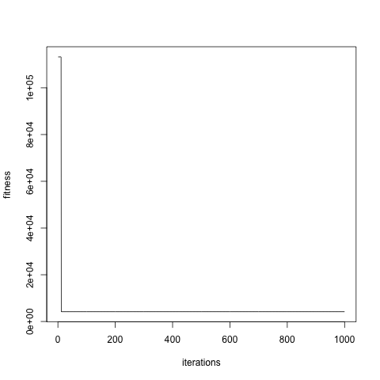

% EA072 - Exercício Computacional 2
% Erick Luis Moraes de Sousa (RA 095696); Guilherme P. Gonçalves (RA 091429)
% Novembro de 2013

# Introdução

Este relatório contém os resultados de cinco exercícios práticos diferentes envolvendo mineração de textos, aproximação de funções contínuas e algoritmos evolutivos aplicados a problemas de otimização.

# Trabalho desenvolvido

O Exercício 1 pedia o desenvolvimento e aplicação de um método de análise de textos em inglês, de forma a extrair alguma informação interessante de um corpo de textos cuja análise seria de outra forma impraticável.

Nossa abordagem aplicou uma técnica conhecida de mineração de textos, o [modelo de espaço vetorial][tf-idf], a um conjunto de emails de spam disponível publicamente, de forma a identificar aqueles que possuem características em comum. Tal análise tem aplicação prática devido à forma como o texto de emails de spam é frequentemente modificado de formas sutis, visando a enganar filtros existentes -- uma vez identificadas as relações de proximidade entre conjuntos de emails indesejados, é possível desenvolver técnicas mais refinadas para tratar aquele conjunto.

[tf-idf]: http://doi.acm.org/10.1145/361219.361220

O Exercício 2 aborda a aproximação de funções R1 -> R1 e R3 -> R1. Utilizando o software [Eureqa][sw-eureqa] e de posse de algumas amostras (com e sem ruído), o grupo alimentou o software Eureqa para obter aproximações para algumas funções escolhidas.

O Exercício 3 abordava o [Problema da Partição][wiki-partition], conhecido por ser NP-Completo, sob o ponto de vista da computação evolutiva. Desenvolvemos um algoritmo com e sem busca local, que foi aplicado a um conjunto de números fornecido pelo professor, de forma a buscar uma bipartição do conjunto que minimizasse a diferença entre as somas dos elementos das duas partes.

[wiki-partition]: https://en.wikipedia.org/wiki/Partition_problem

O Exercício 4 é o [Problema do Caixeiro Viajante][wiki-tsp], um clássico problema de otimização combinatória e de complexidade NP-Difícil. Foi desenvolvido um algorítmo com e sem busca local, aplicado a dois conjuntos de teste: o fornecido pelo professor e o circuito [berlin52][data-berlin52].

[wiki-tsp]: http://en.wikipedia.org/wiki/Travelling_salesman_problem
[data-berlin52]: http://www.iwr.uni-heidelberg.de/groups/comopt/software/TSPLIB95/tsp/berlin52.tsp.gz

# Resultados

# Exercício 1

O algoritmo desenvolvido no Exercício 1 foi implementado na linguagem R e executa sobre o corpo de emails de entrada os seguintes passos:

- Cada email é lido e dividido em palavras com o auxílio da biblioteca [RWeka][rweka]
- Algumas palavras muito comuns (stopwords) são filtradas;
- Alguns caracteres comuns em emails, e outros que não costumam fazer parte de palavras, como > e ", são filtrados das palavras;
- As palavras passam por um processo de _stemming_, novamente usando a biblioteca RWeka, para reduzir palavras semelhantes a uma raiz comum;
- Computa-se um dicionário global contendo todas as palavras de todos os emails;
- Para palavra no dicionário, calcula-se seu índice idf (_inverse document frequency_) em relação ao corpo de emails;
- Para cada palavra e email, calcula-se o índice tf (_term frequency_, número de aparições  da palavra no email);
- Cada email é então descrito por um _feature vector_ dado pelo produto interno entre a linha correspondente a ele na matriz tf e o vetor idf;
- Os _feature vectors_ são agrupados usando o algorithm k-means com distância Euclidiana.

Na última etapa, testamos vários valores de k para o algoritmo k-means, de 1 a 100, e escolhemos o valor 15 segundo o Método do Cotovelo [elbow], conforme ilustrado na Figura 1. O erro é definido como a soma dos quadrados das distâncias de cada vetor ao centro de seu cluster.

Esse algoritmo foi aplicado à parte do conjunto de treinamento classificada como spam do dataset [CSDMC2010][spam], em um total de 1378 emails. 

A Tabela 1 contém o email centróide e o a característica principal identificada para cada cluster, baseado no centróide e nos 3 emails mais próximos a ele, e a Tabela 2 contém esses 3 emails para cada cluster.

 Cluster         Centróide               Característica
---------     ---------------       ---------------------------------------------------------------------------------------------
    1         TRAIN_03956.eml        HTML, pouco texto e links para sites russos de ofertas
    2         TRAIN_02612.eml        Venda de remédios contra disfunção erétil
    3         TRAIN_04237.eml        Textos aleatórios com links falsos para domínios russos
    4         TRAIN_01831.eml        Similar ao cluster 1, com ofertas de medicamentos Pfizer
    5         TRAIN_02392.eml        Venda de relógios Rolex
    6         TRAIN_03025.eml        Notificações de mensagens com links enviadas por Facebook
    7         TRAIN_02581.eml        Emails em HTML vendendo o antivirus Norton      
    8         TRAIN_01324.eml        Emails com assuntos diversos, e corpo codificado em base64
    9         TRAIN_01459.eml        HTML, links e comentários tirados de livros em domínio público
    10        TRAIN_03729.eml        Tentativas de golpes similares ao [scam nigeriano][nigerian]
    11        TRAIN_02948.eml        Nenhuma característica em comum
    12        TRAIN_01064.eml        HTML, venda de acessórios de informática
    13        TRAIN_02491.eml        Ofertas de seguros
    14        TRAIN_01148.eml        Newsletters com forte uso de HTML
    15        TRAIN_00844.eml        Oferta de serviços de spam

Table: Centróides para cada um dos clusters

 Cluster      Emails mais próximos
---------   ------------------------
1           TRAIN_01247.eml TRAIN_02808.eml TRAIN_00105.eml 
2           TRAIN_00694.eml TRAIN_04102.eml TRAIN_02845.eml 
3           TRAIN_03030.eml TRAIN_03837.eml TRAIN_01907.eml 
4           TRAIN_02328.eml TRAIN_02288.eml TRAIN_00371.eml 
5           TRAIN_02033.eml TRAIN_02717.eml TRAIN_01238.eml 
6           TRAIN_01677.eml TRAIN_03142.eml TRAIN_00120.eml 
7           TRAIN_02769.eml TRAIN_02186.eml TRAIN_01776.eml 
8           TRAIN_02915.eml TRAIN_02643.eml TRAIN_03740.eml 
9           TRAIN_03959.eml TRAIN_00791.eml TRAIN_02220.eml 
10           TRAIN_01547.eml TRAIN_01728.eml TRAIN_02195.eml 
11           TRAIN_01182.eml TRAIN_03097.eml TRAIN_00000.eml 
12           TRAIN_04193.eml TRAIN_01150.eml TRAIN_02721.eml 
13           TRAIN_04268.eml TRAIN_01631.eml TRAIN_02590.eml 
14           TRAIN_01058.eml TRAIN_02585.eml TRAIN_01854.eml 
15           TRAIN_00400.eml TRAIN_02835.eml TRAIN_03298.eml

Table: Emails mais próximos do centróide em cada cluster

Foi possível assim obter informações interessantes e um agrupamento razoável a partir dos emails usados como entrada.

# Exercício 2

Inicialmente o grupo escolheu um mapeamento simples R1 -> R1 com uma amostragem pequena e sem ruídos para entender o funcionamento do Eureqa. A função escolhida é f(x) = 3.5x + 5. Com a amostragem contida na tabela a seguir, o Eureqa obteve como resposta g(x) = 3.5x + 4.99.

x           y = f(x)
--------    -------------
1           8.5
2           12
3           15.5
4           19
5           22.5
6           26
7           29.5
8           33
9           36.5
10          40

Table: Amostragem sem ruídos para f(x) = 3.5x + 5.

A seguir, testamos um mapeamento R3 -> R1, f(x,y,z) = x*y + z -1. Com 10 amostragens e sem ruído, o Eureqa obteve como resulta f(x,y,z) = x*y + z - 0.99. A tabela abaixo contém o valor dos mapeamentos.

\begin{table}
\centering
\begin{tabular}{c c c c}
\hline
x & y & z & f(x,y,z)\\
\hline
1 & -4 & 0.5 & -4.5\\
2 & -3 & 1 & -6\\
3 & -2 & 1.5 & -5.5\\
4 & -1 & 2 & -3\\
5 & 0 & 2.5 & 1.5\\
6 & 1 & 3 & 8\\
7 & 2 & 3.5 & 16.5\\
8 & 3 & 4 & 27\\
9 & 4 & 4.5 & 39.5\\
10 & 5 & 5 & 54\\
\end{tabular}
\caption{Amostragem da função f(x,y,z) = x*y + z - 1}
\end{table}

Utilizando a mesma função, adicionamos ruído à variável x. O mapeamento encontrado pelo Eureqa é f(x,y,z) = x*y + z - 0.977. 

Finalmente, testamos uma função mais complexa com o Eureqa. A função utilizada foi f(x,y,z) = x*y*z + cos(x)*sin(x) + y*y - z. Com 10 amostras, o Eureqa obteve como solução f(x,y,z) = x*y*z + y*y - z + 0.0433. 

Observa-se que mesmo com um pequeno conjunto de amostras e ruído, o software Eureqa foi capaz de aproximar satisfatoriamente mesmo funções mais complexas.

# Exercício 3

O algoritmo evolutivo desenvolvido para o Problema da Partição no Exercício 3 pode ser expresso de forma concisa em pseudocódigo. Em alto nível, o espaço do problema é explorado através da geração sucessiva de gerações a partir de um número inicial de indivíduos (1000, em nossos testes), até um número máximo de iterações (também 1000 em nossos experimentos).

~~~
generation = create_initial_generation()
best_individual = get_best_individual(generation)

repeat for max_it iterations:
	next_generation = create_next_generation(generation)
	next_best = get_best_individual(next_generation)

	if next_best is better than best_individual:
		best_individual = next_best
	generation = next_generation
~~~~

Cada indivíduo representa uma possível solução, e é codificado por um vetor binário que dá, para cada número, o conjunto a que ele pertence na bipartição. Logo, para um indivíduo representado por 1001, a bipartição separa o primeiro e o último números dos dois outros. O _fitness_ do indivíduo é dado pela diferença entre as somas dos números em cada conjunto da bipartição; dessa forma, um _fitness_ menor é melhor.

A subrotina `create_initial_generation` simplesmente gera um conjunto de indivíduos aleatórios, e a subrotina `get_best_individual` atravessa os indivíduos de uma geração comparando seu _fitness_ e retorna aquele com menor valor.

A subrotina `create_next_generation` possui o pseudocódigo abaixo.

~~~
create_next_generation(generation):
	next_generation = cross_over(generation)
	mutate(next_generation)
	local_search(next_generatio)

	return next_generation
~~~

A subroutine `cross_over` implementa a reprodução de indivíduos. São escolhidos N indivíduos para reprodução, onde N é o tamanho da geração, usando o algoritmo de _Roulette Wheel_, em que indivíduos são escolhidos aleatoriamente com reposição com probabilidades proporcionais a seu fitness (ou seja, indivíduos mais aptos têm maior probabilidade de serem escolhidos). Esses indivíduos são tomados em pares e cruzados usando um ponto de corte aleatório.

~~~
cross_over(generation):
	cross_individuals = roulette_wheel_choice(generation)
	for parent1 and parent2 consecutive in cross_individuals:
		crossing_point = random index between 0 and length(individual)
		next_generation += parent1[:crossing_point] + parent2[crossing_point:]
		next_generation += parent2[:crossing_point] + parent1[crossing_point:]
~~~ 

A subrotina `mutate` simplesmente atravessa toda a geração e, para cada indivíduo, altera um bit aleatório com probabilidade 0.05.

Finalmente, a subrotina `local_search` implementa uma busca local: para cada um dos indivíduos, dados dos dois subconjuntos determinados por ele, busca-se naquele de maior soma o maior número que se pode passar para o de menor soma de forma a diminuir a diferença entre eles (e, portanto, melhorar o _fitness_ do indivíduo). Caso isso seja possível, essa troca é feita e o indivíduo é atualizado.

~~~
local_search(generation):
	for individual in generation:
		let s1 and s2 be subsets in the bipartition determined by the individual
		let bigger_set be the subset with largest element sum
		let fitness be the fitness of the individual

		bigger_set = sort(bigger_set)
		for i = 0 to length(individual) - 1:
			if bigger_set[i+1] > fitness / 2:
				break

		n = bigger_set[i]
		if n > fitness / 2:
			continue

		flip in individual the bit corresponding to n
~~~

Esse algoritmo foi executado 32 vezes com e sem busca local sobre os números fornecidos pelo professor. Para as execuções com busca local, o melhor resultado obtido foi um _fitness_ de 15, enquanto que sem busca local o melhor _fitness_ foi de 2275.

A Figura 2 ilustra a evolução do _fitness_ ao longo das gerações na melhor execução com busca local.

A busca convergiu para o valor 15 após apenas 13 iterações. Nota-se que, embora a busca local tenha sido bastante eficaz em acelerar a convergência do algoritmo, nem ela nem os mecanismos de mutação e crossing over foram capazes de encontrar soluções melhores fora desse vale.

A Figura 3 ilustra a evolução do _fitness_ na melhor execução sem busca local.

O melhor _fitness_ nesse caso foi obtido após apenas 3 iterações, novamente evidenciando a dificuldade do algoritmo em sair de vales no espaço de busca.

[spam]: http://csmining.org/index.php/spam-email-datasets-.html
[rweka]: http://cran.r-project.org/web/packages/RWeka/index.html
[nigerian]: https://en.wikipedia.org/wiki/Nigerian_prince

# Exercício 4

Para resolver o Problema do Caixeiro Viajante, utilizou-se um Algorítmo Genético cujo pseudo-código encontra-se a seguir:

~~~
cur_gen = create_initial_generation(vertices)
best_solution = get_best_solution(cur_generation)

repeat for max_it iterations:
    next_gen = create_next_generation(vertices, cur_gen)
    next_best = get_best_solution(next_gen)

    if next_best is better than best_solution:
        best_solution = next_best
    cur_gen = next_gen
~~~

Um indivíduo de uma geração é representado por uma lista de vértices que compõe um ciclo hamiltoniano. Inicialmente executamos a subrotina `create_initial_generation`, rotina esta que cria aleatoriamente um ciclo hamiltoniano. Como o grafo é completo, qualquer combinação de vértices sem repetição é uma solução válida. Logo em seguida, chamamos a subrotina `get_best_individual` que retorna o indivíduo de melhor score da geração atual. 

Para criar a próxima geração, utilizamos três abordagens. Para cada solução da geração atual, com probabilidade 0.05, aplicamos o operador de mutação, que troca aleatoriamente dois vertices de posição e calcula o novo fitness. Se a solução melhorou, então a mantemos, caso contrário destrocamos os vértices.

Seja M um indíduo mutado gerado pelo passo anterior do algorítmo. Aplicamos o operador de cross-over em M e um indivíduoP aleatório da geração atual(de elementos não mutados). O cross-over seleciona um sub-conjunto aleatório de M e completa, em ordem de aparição, com os vértices que estão em P e não estão em M.

Por fim, aplicamos um algorítmo de busca local que visa trocar um vértice com seus dois vizinhos imediatos se puder haver um ganho com isto. Sejam três vértices consecutivos u, v e w e suas respectivas distância Duv, Dvw e Duw. Os vértices v e w são trocados se, e somente se, Duw > Duv + Dvw.

~~~
create_next_generation(vertices, cur_gen):
    next_gen = []
    for each solution s in cur_gen:
        p = random float between 0 and 1
        if p <= 0.05:
            mutated = mutate(s)
        else:
            mutated = s
        offspring = cross_over(vertices, mutated, random solution in cur_gen)

        offspring = local_search(offspring)

        if offspring is better than mutated:
            next_gen = next_gen + offspring
        else:
            next_gen = next_gen + mutated
        
    return next_gen
~~~

~~~
mutate(solution):
    i = random index between 0 and length(solution)
    j = random index between 0 and length(solution)

    new_sol = swap_vertices(solution, i, j)

    if score(new_sol) > score(solution):
        new_sol = swap_vertices(solution, i, j)

    return new_sol
~~~

~~~
cross_over(vertices, s1, s2):
    cut1 = random index between 0 and length(s1)
    cut2 = random index between cut1 + 1 and length(s1)

    offspring = s1[cut1:cut2]
    for each vertex v in s2:
        if v not in offspring:
            offspring = offspring + v

    return offspring
~~~

~~~
local_search(solution):
    for each vertex v in solution:
        u = ancestor(v)
        w = successor(v)

        duv = distance(u,v)
        duw = distance(u,w)
        dvw = distance(v,w)

        if duw < duv + dvw:
            solution = swap(solution, v, w)

    return solution
~~~

Abaixo temos a análise do circuito berlin52 com e sem busca local. De acordo com o site de [instâncias do TSP][comopt], o valor ótimo para o circuito berlin52 é 7542. Pegando o melhor resultado de 30 execuções, com 1000 indivíduos inicialmente e iterando 1000 vezes, obtivemos que com a busca local ativada, a melhor solução encontrada foi de 7675. Com os mesmos parâmetros, mas com a busca local desativada, a melhor solução encontrada foi de 7544. Como ambas as soluções são próximas do ótimo, o pior desempenho do algorítmo com busca local pode ser explicado pelo fato de que ele tende a convergir para mínimos mais rapidamente e os operadores de mutação e cross-over não conseguiram retirá-lo do vale. As Figuras 4 e 5 mostram o comportamento do _fitness_ através das gerações.

[comopt]: http://comopt.ifi.uni-heidelberg.de/software/TSPLIB95/STSP.html

Para o circuito fornecido pelo professor, utilizando os mesmos parâmetros anteriores, obtivemos que com busca local, a melhor solução obtida é 874. Sem busca local, obtivemos 834. Observa-se que em ambos circuitos a solução demorou para convergir.  

# Exercício 5

O último problema a ser atacado é o [Problema do Quadrado Mágico][wiki-ms]. A seguir apresentamos uma estratégia utilizando algorítmos genéticos para solucionar o problema.

[wiki-ms]: http://en.wikipedia.org/wiki/Magic_square

~~~
magic_num = n * ((n^2 + 1)/2)
cur_gen = create_initial_generation(magic_square_size)
best_solution = get_best_solution(cur_generation, magic_num)

repeat for max_it iterations:
    next_gen = create_next_generation(cur_gen, magic_num)
    next_best = get_best_solution(next_gen, magic_num)

    if next_best is better than best_solution:
        best_solution = next_best
    cur_gen = next_gen
~~~

Um indivíduo de uma geração é representado por uma matriz de inteiros, cujos valores vão de 1 até x^2, onde x é o número de linhas do quadrado mágico. Inicialmente executamos a subrotina `create_initial_generation`, rotina esta que cria aleatoriamente uma matriz de inteiros no intervalo [1, x^2]. A subrotina `get_best_individual` retorna o indivíduo com melhor score, calculado somando-se a diferença de todas as colunas, linhas e diagonais principais e o número mágico, isto é:

~~~
calc_fitness(solution, magic_number):
    return sum_rows(solution, magic_number) + 
        sum_cols(solution, magic_number) +
        sum_diags(solution, magic_number)

sum_rows(solution, magic_number):
    score = 0
    for each row in solution:
        s = sum of all numbers in the row
        score = score + (s - magic_number)

    return score

sum_cols(solution, magic_number):
    score = 0
    for each column in solution:
        s = sum of all numbers in the column
        score = score + (s - magic_number)

    return score

sum_diags(solution, magic_number):
    score = 0
    for each principal diagonal in solution:
        s = sum of all numbers in the diagonal
        score = score + (s - magic_number)

    return score
~~~

A criação da próxima geração se dá através de três dispositivos. Com probabilidade 0.05, aplicamos o operador de mutação. Este operador realiza a troca de posição aleatóriamente entre dois elementos da matriz. Caso a solução melhore, mantemos como está, caso contrário, desfazemos a troca.

Aplicamos, então, o operador de cross-over, que combina um sub-conjunto de colunas do primeiro indivíduo com um sub-conjunto de colunas do segundo indivíduo. Se o fitness melhorou, então a solução é adicionada a nova geração. Se o fitness não melhorou, então adicionamos o melhor dentre os dois pais.

Uma busca local é aplicada. Com probabilidade 0.5 aplicamos ela às linhas, com probabilidade 0.5 aplicamos ela às colunas. Trocamos elementos adjacentes dois a dois de todas as colunas/linhas do indivíduo, sempre verificando se a solução recebe melhoria e destrocando, caso não haja.

~~~
create_next_generation(cur_gen, magic_number):
    next_gen = []
    for each solution s in cur_gen:
        p = random float between 0 and 1
        if p <= 0.05:
            mutated = mutate(s, magic_number)
        else:
            mutated = s

        offspring = cross_over(mutated, random solution in cur_gen, magic_number)

        p = random float between 0 and 1
        if p <= 0.5:
            local_search_columns(offspring, magic_number)
        else:
            local_search_rows(offspring, magic_number)

        next_gen += offspring
        
    return next_gen
~~~

~~~
mutate(solution):
    i1 = random index between 0 and length(solution)
    j1 = random index between 0 and length(solution)
    i2 = random index between 0 and length(solution)
    j2 = random index between 0 and length(solution)

    new_sol = swap_numbers(solution, i1, j1, i2, j2)

    if score(new_sol) > score(solution):
        new_sol = swap_numbers(solution, i1, j1, i2, j2)

    return new_sol
~~~

~~~
cross_over(s1, s2, magic_number):
    cut1 = random index between 0 and length(s1)

    offspring = s1[:cut1]
    offspring += s2[cut1:]

    return offspring
~~~

~~~
local_search_rows(solution, magic_number):
    for each row r in solution:
        swap pairwise the elements of r
        calculate the fitness of the new configuration
        if solution did not improve, swap back

    return solution

local_search_cols(solution, magic_number):
    for each col c in solution:
        swap pairwise the elements of c
        calculate the fitness of the new configuration
        if solution did not improve, swap back

    return solution
~~~

Seguindo o mesmo modelo dos testes anteriores, o algorítmo genético foi executado com uma população inicial de 1000 indivíduos por 1000 iterações. O quadrado mágico analisado possui tamanho 10. Foram realizadas 30 repetições. Com busca local, obtivemos que a melhor solução foi de 34. Sem busca local, obtivemos que a melhor foi de 239. Vale ressaltar que não há garantia de que o quadrado mágico possui solução com os números inicialmente dispostos.

Notamos que desta vez o algorítmo converge muito mais rapidamente para um mínimo local, e pode-se
ver que há uma forte resistência em sair do mesmo.
